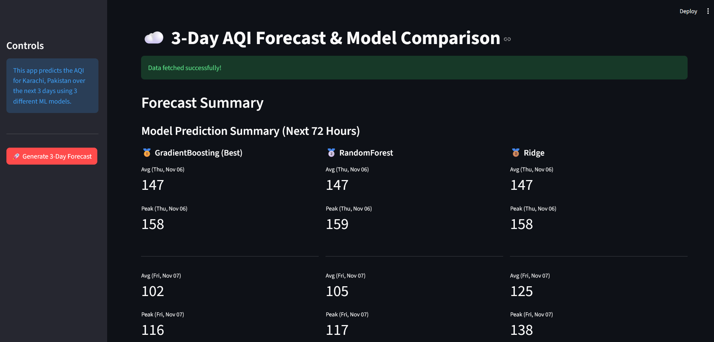
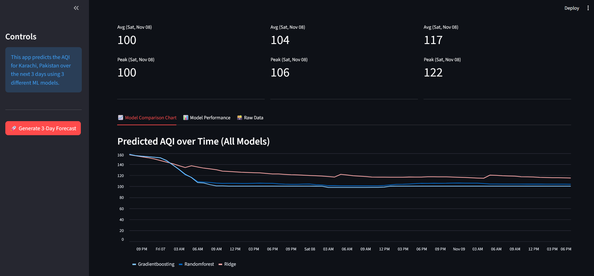
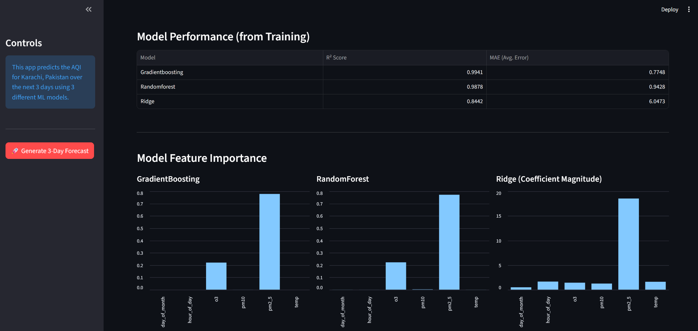
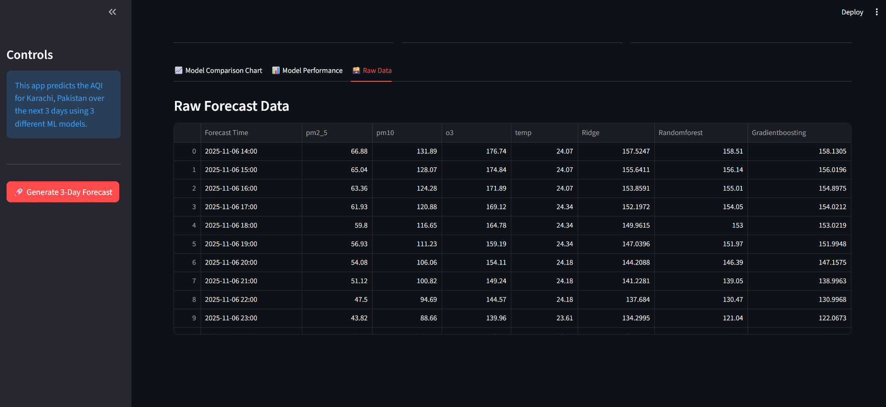

[](https://github.com/Uzair-A-Jokhio/AQI-Predictor/actions/workflows/feature_preprocessing.yml) [](https://github.com/Uzair-A-Jokhio/AQI-Predictor/actions/workflows/model_traning.yml)  [](https://github.com/Uzair-A-Jokhio/AQI-Predictor/actions/workflows/main.yml)
# End-to-End MLOps AQI Predictor

This repository contains the complete code for an end-to-end MLOps pipeline that forecasts the Air Quality Index (AQI) for Karachi, Pakistan.

The pipeline automatically collects data, processes features, retrains three different machine learning models daily, and serves a live 3-day forecast via an interactive Streamlit dashboard.

## Dashboard
 


   

---

## 🚀 Key Features

* **Automated Data Pipeline:** A GitHub Action runs hourly to fetch and store the latest weather and pollutant data from OpenWeatherMap.
* **Automated Feature Engineering:** A second GitHub Action runs every 24 hours to transform raw data into a clean, model-ready feature set.
* **Automated Model Retraining:** A third GitHub Action triggers after feature engineering, automatically retraining different Scikit-learn models on the new data.
* **Centralized MLOps Platform:** Uses **Hopsworks** as a Feature Store (to store data) and a Model Registry (to store trained models and their performance metrics).
* **Live Forecast Dashboard:** A **Streamlit** app that:
    * Downloads all 3 trained models directly from the Hopsworks Model Registry.
    * Fetches the next 3 days (72 hours) of forecast data from OpenWeatherMap.
    * Displays a forecast comparison chart showing how all 3 models perform.
    * Summarizes the daily average and peak AQI for the top models.
    * Shows the R² scores, MAE, and feature importances for all models.

## ⚙️ Tech Stack

| Component | Technology | Purpose |
| :--- | :--- | :--- |
| **Automation** | GitHub Actions | Orchestrates all data, feature, and training pipelines. |
| **ML Platform** | Hopsworks | Feature Store & Model Registry (Saves data & models). |
| **Data Source** | OpenWeatherMap API | Provides historical, current, and future weather/pollutant data. |
| **ML Models** | Scikit-learn | `Ridge`, `RandomForest`, `GradientBoosting`. |
| **Frontend** | Streamlit | The interactive web dashboard. |

## 📁 How the Pipeline Works

This project is built on three automated GitHub Action workflows:

1.  **`data_collector.yml` (Hourly)**
    * **Trigger:** Runs on an hourly `cron` schedule.
    * **Action:** Fetches the *current* raw weather and pollutant data from OpenWeatherMap.
    * **Destination:** Inserts this new data into the `aqi_weather_data_hourly` Feature Group in Hopsworks.

2.  **`feature_processing.yml` (Every 24 Hours)**
    * **Trigger:** Runs on a 23-hour `cron` schedule.
    * **Action:** Reads all data from `aqi_weather_data_hourly`, calculates `calculated_aqi`, `hour_of_day`, and `day_of_month`.
    * **Destination:** Saves this clean, transformed data to the `aqi_ml_training_features` Feature Group.

3.  **`model_training.yml` (On Completion)**
    * **Trigger:** Runs automatically after the `feature_processing.yml` job successfully completes (`workflow_run`).
    * **Action:** Reads from `aqi_ml_training_features`, splits the data, and trains all 5 models.
    * **Destination:** Saves all 5 trained models, their `scaler.pkl`, and their performance metrics (`R²`, `MAE`) to the Hopsworks Model Registry.

## 🚀 How to Run and Deploy

###  Local Setup

1.  **Clone the repository:**
    ```bash
    git clone [your-repo-url]
    cd [your-repo-name]
    ```

2.  **Install Java (Crucial):**
    The `hopsworks` Python library requires a Java Development Kit (JDK) to run. Make sure you have a JDK installed (version 8 or 11 is recommended).

3.  **Create your `.env` file:**
    Create a file named `.env` in the root folder. This file holds your secret keys and is ignored by Git.

    ```.env
    HOPSWORKS_PROJECT_NAME="your_project_name"
    HOPSWORKS_API_KEY="your_hopsworks_api_key"
    OPENWEATHER_API_KEY="your_openweather_api_key"
    ```

4.  **Install Python libraries:**
    ```bash
    pip install -r requirements.txt
    ```

5.  **Run the Streamlit App:**
    ```bash
    streamlit run app.py
    ```


Your app will now build and go live on a public URL.
